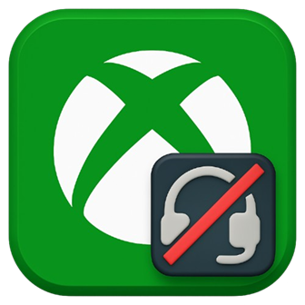

# Gamebar Autodeafen

Gamebar Autodeafen is a Geode mod for Geometry Dash  that automatically mutes Xbox Game Bar party chat when the player reaches a certain percentage in a level. It unmutes on pause, restart, death, completion, or when exiting the level. The system is designed to be simple, stable, and performance-safe.

## Features

- Configurable deafen and undeafen percentages

- Settings available in the pause menu inside levels, and in geode settings

- Compatible with Xbox Game Bar party chat

- Automatically handles pause, restart, and attempt flow correctly

## Credits

Original AutoDeafen concept and frame by Lynxdeer
Written and created by itsobrie
Development assistance provided by ChatGPT
Custom icons created for this project

